<div align="center">

# 🚀 LangGraph — Day 4
### Streaming & Parallel Execution


*A beginner-friendly, revision-ready, practice-focused guide to Graph Streaming, Token Streaming, Stream Modes, Parallel Execution, Fan-out/Fan-in, Parallel LLM Calls, and Parallel Streaming.*

</div>

<br>

> [!NOTE]
> These notes were generated from a full learning session — covering the concepts, mental models, code patterns, and mistakes practiced along the way. They're built to be **re-read**, not just stored.

<br>

## 📚 Table of Contents

<details open>
<summary><b>Click to expand / collapse</b></summary>

<br>

| # | Section |
|---|---|
| 🎯 | [Day 4 Overview](#-day-4-overview) |
| 🧠 | [The Big Picture](#-the-big-picture) |
| 🏗️ | [StateGraph vs Compiled Graph](#️-stategraph-vs-compiled-graph) |
| 🌊 | [What is Streaming?](#-what-is-streaming) |
| ⚙️ | [`app.stream()`](#️-appstream) |
| 🔤 | [Token Streaming with `llm.stream()`](#-token-streaming-with-llmstream) |
| 🧩 | [LangGraph Stream Modes](#-langgraph-stream-modes) |
| ↳🔵 | [`values`](#-values) |
| ↳🟢 | [`updates`](#-updates) |
| ↳🟡 | [`messages`](#-messages) |
| ↳🟠 | [`custom`](#-custom) |
| ↳🔴 | [`debug`](#-debug) |
| ⚡ | [Parallel Execution](#-parallel-execution) |
| ⏱️ | [Parallel Execution with Timing](#️-parallel-execution-with-timing) |
| 🔀 | [Fan-out and Fan-in](#-fan-out-and-fan-in) |
| 🤖 | [Parallel LLM Calls](#-parallel-llm-calls) |
| 🌊🤖 | [Parallel LLM Calls + Streaming](#-parallel-llm-calls--streaming) |
| ⚠️ | [Why Parallel Streaming Looks Mixed](#️-why-parallel-streaming-looks-mixed) |
| 🏷️ | [Node-Aware Streaming](#️-node-aware-streaming) |
| 📦 | [Separate Buffers](#-separate-buffers) |
| 🖥️ | [Live Streaming + Separate Buffers](#️-live-streaming--separate-buffers) |
| 🧪 | [Practical Code Patterns](#-practical-code-patterns) |
| ⚠️ | [Common Beginner Mistakes](#️-common-beginner-mistakes) |
| 🎤 | [Interview Revision](#-interview-revision) |
| 🧾 | [One-Page Cheat Sheet](#-one-page-cheat-sheet) |
| 🏁 | [Final Mental Model](#-final-mental-model) |
| ✅ | [Final Completion Checklist](#-final-completion-checklist) |

</details>

---

## 🎯 Day 4 Overview

Day 4 is about **two closely related ideas**:

> [!IMPORTANT]
> **Streaming** — seeing workflow/model output progressively instead of waiting for everything to finish.
>
> **Parallel execution** — allowing independent branches of a graph to execute concurrently.

The concepts build on top of each other, like a staircase:

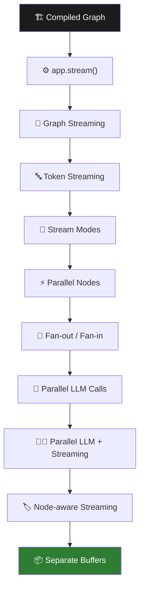

### 💡 Why this matters

Real AI applications often need to do **more than one thing**:

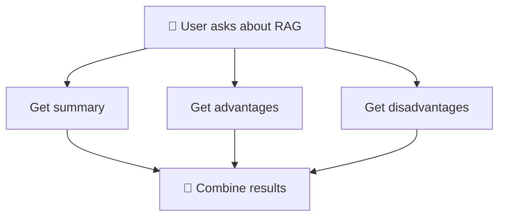

If these tasks are independent, doing them **concurrently** can reduce unnecessary waiting.

At the same time, users don't want to stare at a blank screen while an LLM generates a response — **streaming** lets the application show progress as it happens.

---

## 🧠 The Big Picture

There are **two different questions** being answered here.

<table>
<tr>
<th>❓ Question 1 — Streaming</th>
<th>❓ Question 2 — Parallel Execution</th>
</tr>
<tr>
<td>

**How do I *receive* the result?**

```text
Wait for everything
       ↓
Complete answer
```
vs
```text
Start → Chunk → Chunk → Chunk → ...
```

</td>
<td>

**How does the workflow *perform* independent work?**

```text
Sequential:  A → B → C

Parallel:      ┌─ A ─┐
          START┼─ B ─┼→ Next
               └─ C ─┘
```

</td>
</tr>
</table>

> [!TIP]
> ### ⭐ Important distinction
> | Concept | Answers |
> |---|---|
> | **Streaming** | *How output is delivered* |
> | **Parallel execution** | *How independent work is executed* |
>
> They are **different concepts** — but they can be **combined**.

---

## 🏗️ StateGraph vs Compiled Graph

One of the most important practical mistakes in this topic:

```python
graph.stream(...)   # ❌ error — graph is still the StateGraph builder
```

### 🔁 The correct lifecycle

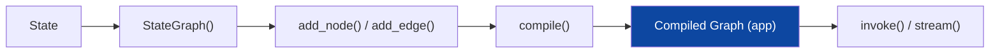

<table>
<tr><th>Step</th><th>Code</th></tr>
<tr><td>1️⃣ Create the builder</td><td>

```python
graph = StateGraph(State)
```
</td></tr>
<tr><td>2️⃣ Define nodes & edges</td><td>

```python
graph.add_node("answer", answer_node)
graph.add_edge(START, "answer")
graph.add_edge("answer", END)
```
</td></tr>
<tr><td>3️⃣ Compile</td><td>

```python
app = graph.compile()
```
</td></tr>
<tr><td>4️⃣ Execute</td><td>

```python
app.invoke(...)
# or
app.stream(...)
```
</td></tr>
</table>

| ❌ Wrong | ✅ Correct |
|---|---|
| `graph.stream(...)` | `app.stream(...)` |

> [!TIP]
> **Mental model:** Think of it like building a machine.
> - `StateGraph` → the **blueprint/builder**
> - `compile()` → **manufactures** the finished machine
> - `app` → the finished machine — **run it**

---

## 🌊 What is Streaming?

<table>
<tr>
<th>🚫 Without Streaming</th>
<th>✅ With Streaming</th>
</tr>
<tr>
<td>

```text
User Question
     ↓
LLM starts generating
     ↓
   Wait...
   Wait...
     ↓
Complete response
     ↓
  Display
```
</td>
<td>

```text
User Question
     ↓
LLM starts generating
     ↓
Chunk 1 → display
Chunk 2 → display
Chunk 3 → display
     ↓
Complete response
```
</td>
</tr>
</table>

### Example

Instead of waiting for the full sentence to appear at once, the application receives it **in pieces**, progressively. The exact chunk boundaries depend on the model and integration.

### ✅ Streaming is useful when...

- ⏳ the model takes noticeable time to respond
- 📄 the answer is long
- 💬 a chat UI should show text immediately
- 📊 you want to show workflow progress
- ⚡ you want to improve *perceived* responsiveness

> [!WARNING]
> Streaming does **not** automatically mean parallel execution.
>
> | Setup | Result |
> |---|---|
> | One node + streaming | Still **sequential** |
> | Multiple independent nodes + streaming | **Parallel streaming** is possible |

---

## ⚙️ `app.stream()`

Once the graph is compiled:

```python
app = graph.compile()
```

You can stream graph execution:

```python
for chunk in app.stream(input_data):
    print(chunk)
```

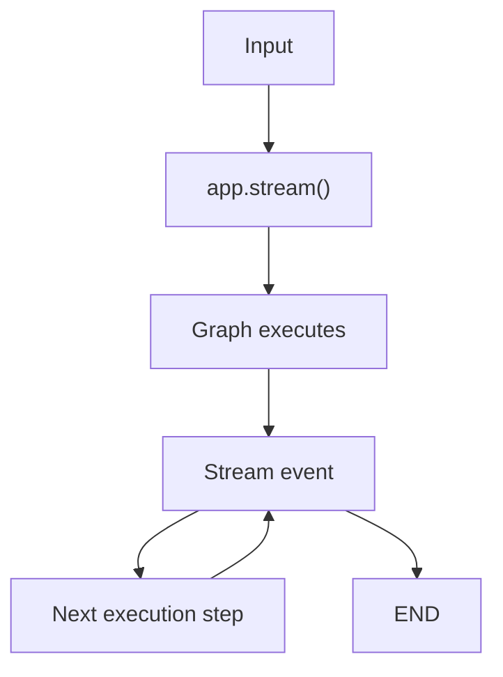

> [!NOTE]
> The exact information received depends on the selected **stream mode** — covered below.

---

## 🔤 Token Streaming with `llm.stream()`

LangGraph streaming and LLM streaming are related, but happen at **different levels**.

| Level | Call | Meaning |
|---|---|---|
| 🕸️ **LangGraph level** | `app.stream(...)` | Stream information about *graph execution* |
| 🤖 **LLM level** | `llm.stream(...)` | Stream the *LLM's generated message chunks* |

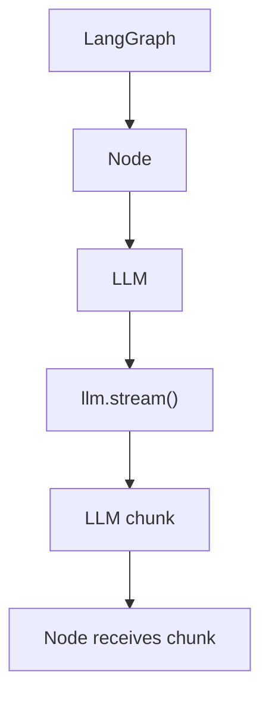

### Basic `llm.stream()` example

```python
for chunk in llm.stream("Explain RAG"):
    if chunk.content:
        print(chunk.content, end="", flush=True)
```

Instead of receiving only the final answer, chunks are processed **as they arrive**.

### Sending token chunks through LangGraph

```python
from langgraph.config import get_stream_writer
```

Inside the node:

```python
def answer_node(state: State):
    writer = get_stream_writer()
    answer = ""

    for chunk in llm.stream(state["question"]):
        if chunk.content:
            writer(chunk.content)
            answer += chunk.content

    return {"answer": answer}
```

Then consume it:

```python
for chunk in app.stream(input_data, stream_mode="custom"):
    print(chunk, end="", flush=True)
```

> [!TIP]
> **Why keep `answer` at all?** Because there are **two separate jobs**:
>
> | Line | Job |
> |---|---|
> | `writer(chunk.content)` | Send the chunk **immediately** |
> | `answer += chunk.content` | Build the **complete result** for state |
>
> So streaming doesn't mean you lose the final state.

---

## 🧩 LangGraph Stream Modes

The main stream modes practiced:

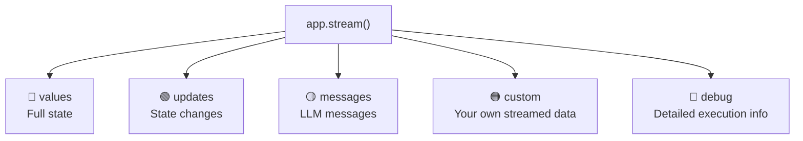

Think of them as **different views of the same workflow**.

---

### 🔵 `values`

Gives the **full state** after graph execution steps.

```python
for chunk in app.stream(input_data, stream_mode="values"):
    print(chunk)
```

<table>
<tr><th>Before</th><th>After</th></tr>
<tr><td>

```python
{
    "name": "Prem",
    "age": 25
}
```
</td><td>

```python
{
    "name": "Prem",
    "age": 25,
    "city": "Hyderabad"
}
```
</td></tr>
</table>

> 💭 **Memory trick:** `values` = **whole state** — *"Show me the current complete state."*

---

### 🟢 `updates`

Focuses on the state **updates** produced during node execution.

```python
for chunk in app.stream(input_data, stream_mode="updates"):
    print(chunk)
```

```python
# a node returns:
return {"answer": "Hello"}
# → the stream reports just that update
```

> 💭 **Memory trick:** `updates` = **what changed**

---

### 🟡 `messages`

Used for streaming **LLM message chunks** together with metadata.

```python
for message, metadata in app.stream(input_data, stream_mode="messages"):
    if message.content:
        print(message.content, end="", flush=True)
```

Useful when the graph contains LLM calls and you want to observe the model's message stream.

> [!IMPORTANT]
> | Mode | Streams |
> |---|---|
> | `messages` | LLM message/token-oriented stream |
> | `custom` | Data that **your node explicitly sends** |

---

### 🟠 `custom`

Lets your application explicitly decide **what** gets streamed.

```python
from langgraph.config import get_stream_writer

writer = get_stream_writer()
writer("Processing...")
```

Consume:

```python
for chunk in app.stream(input_data, stream_mode="custom"):
    print(chunk)
```

**Structured custom data** (used later for multi-node streaming):

```python
writer({
    "node": "summary",
    "content": chunk.content
})
```

> 💭 **Memory trick:** `custom` = **my own streaming data**

---

### 🔴 `debug`

Detailed information about graph execution — mainly useful while **learning and debugging**.

```python
for chunk in app.stream(input_data, stream_mode="debug"):
    print(chunk)
```

> 💭 **Memory trick:** `debug` = **show me detailed execution information**

---

## ⚡ Parallel Execution

### What is parallel execution?

Independent graph branches can execute **concurrently**.

<table>
<tr><th>Sequential</th><th>Parallel</th></tr>
<tr><td>

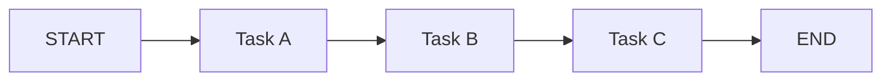
`A=2s, B=2s, C=2s → Total ≈ 6 sec`
</td><td>

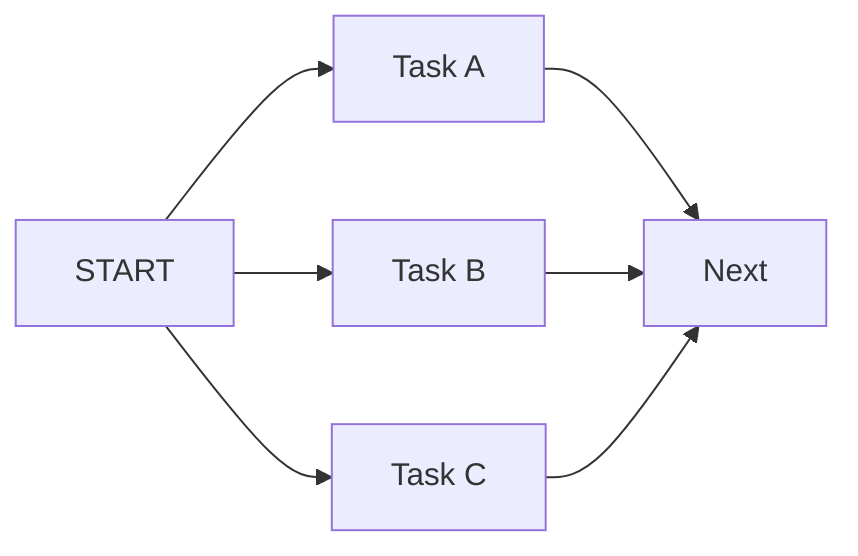
`A=2s, B=2s, C=2s → Total ≈ 2 sec`
</td></tr>
</table>

> [!NOTE]
> Actual timing depends on scheduling, API latency, rate limits, and the execution environment.

### 🔑 When can nodes be parallel?

> [!IMPORTANT]
> The branches **should not depend on each other's results.**

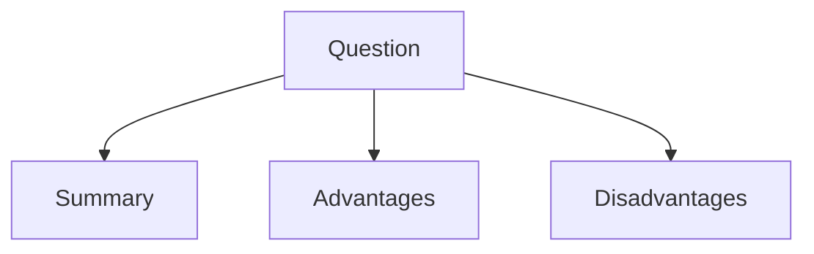
All three independently use the same input → ✅ **parallelizable**

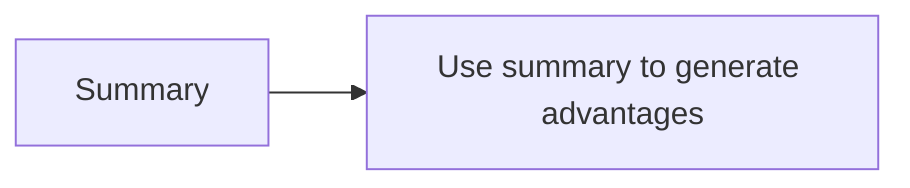
This has a **dependency** → naturally **sequential**

---

## ⏱️ Parallel Execution with Timing

To understand the benefit, we practiced with artificial delays:

```python
import time

def task_a(state):
    time.sleep(2)
    return {"result_a": "A completed"}

def task_b(state):
    time.sleep(2)
    return {"result_b": "B completed"}

def task_c(state):
    time.sleep(2)
    return {"result_c": "C completed"}
```

| Model | Timing |
|---|---|
| 🐢 Sequential | Task A (2s) → Task B (2s) → Task C (2s) ≈ **6 seconds** |
| 🚀 Parallel | Task A, B, C **overlap** ≈ **2 seconds** |

---

## 🔀 Fan-out and Fan-in

Two important graph patterns.

<table>
<tr>
<th>🔀 Fan-out</th>
<th>🔁 Fan-in</th>
</tr>
<tr>
<td>

> **One point splits execution into multiple branches.**

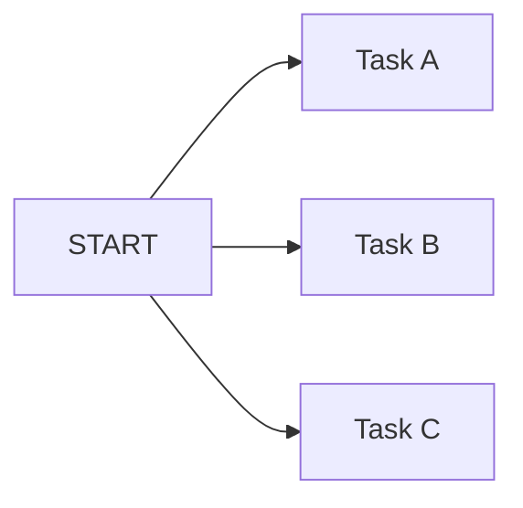
💭 *Fan-out = split the work*
</td>
<td>

> **Multiple branches converge into a later step.**

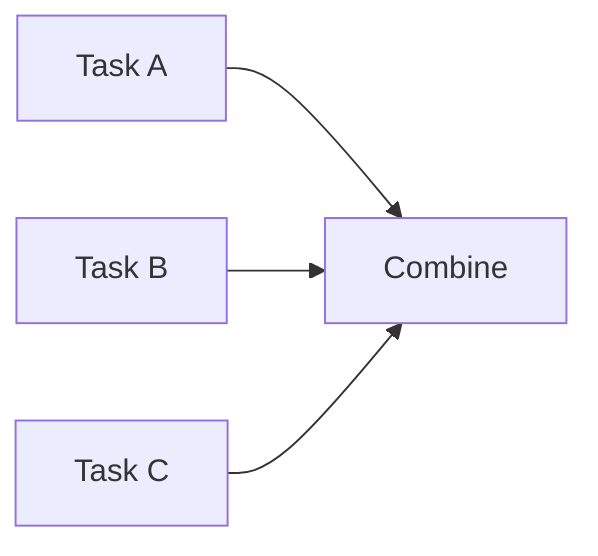
💭 *Fan-in = collect the work*
</td>
</tr>
</table>

### 🔗 Complete fan-out/fan-in pattern

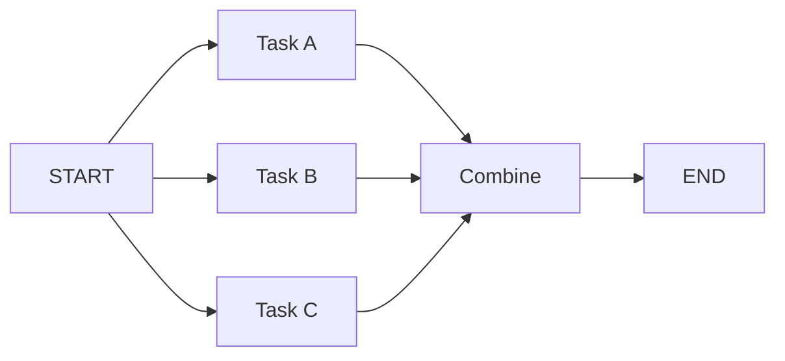

**Why is `Combine` useful?** Each parallel branch returns a different part of the state:

```python
class State(TypedDict):
    task1_result: str
    task2_result: str
    task3_result: str
    final_result: str
```

The combine node reads all three and creates:

```python
return {"final_result": final_result}
```

---

## 🤖 Parallel LLM Calls

The same graph pattern works with LLMs. Topic = `RAG`.

<table>
<tr><th>🐢 Sequential Approach</th><th>🚀 Parallel Approach</th></tr>
<tr><td>

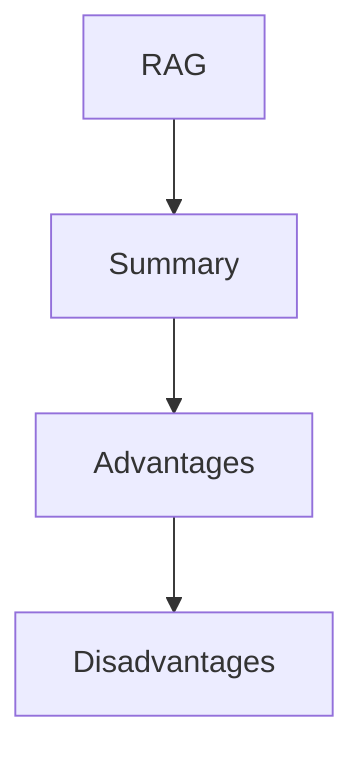
</td><td>

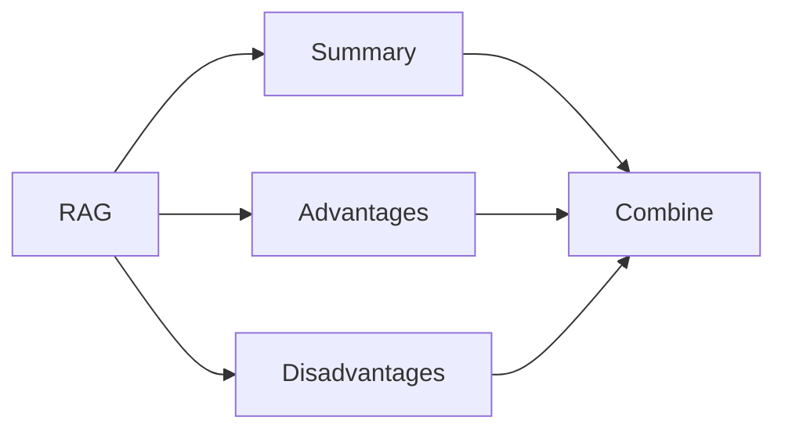
</td></tr>
</table>

<details>
<summary><b>📄 Node implementations (click to expand)</b></summary>

**Summary node**
```python
def summary_node(state: State):
    response = llm.invoke(f"Give a short summary of {state['topic']}.")
    return {"summary": response.content}
```

**Advantages node**
```python
def advantages_node(state: State):
    response = llm.invoke(f"List 3 advantages of {state['topic']}.")
    return {"advantages": response.content}
```

**Disadvantages node**
```python
def disadvantages_node(state: State):
    response = llm.invoke(f"List 3 disadvantages of {state['topic']}.")
    return {"disadvantages": response.content}
```

**Graph structure**
```python
graph.add_edge(START, "summary")
graph.add_edge(START, "advantages")
graph.add_edge(START, "disadvantages")

graph.add_edge("summary", "combine")
graph.add_edge("advantages", "combine")
graph.add_edge("disadvantages", "combine")

graph.add_edge("combine", END)
```

</details>

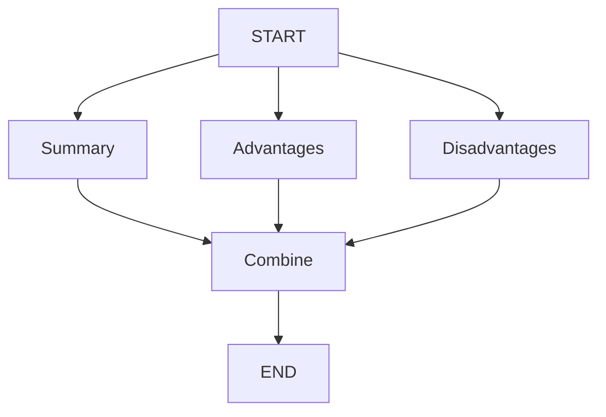

---

## 🌊 Parallel LLM Calls + Streaming

Now combine the two major ideas: **Parallel Execution + LLM Streaming**. Each branch streams its own LLM output.

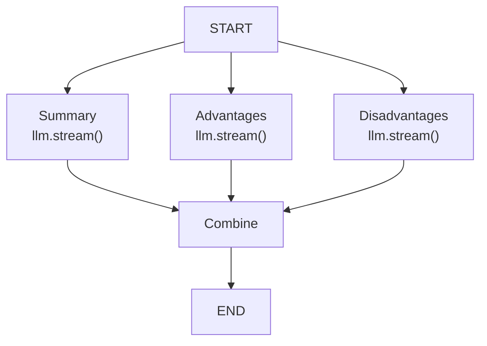

### Core node pattern

```python
def summary_node(state: State):
    writer = get_stream_writer()
    answer = ""

    writer("\n\n--- SUMMARY ---\n")

    for chunk in llm.stream(f"Give a short summary of {state['topic']}."):
        if chunk.content:
            writer(chunk.content)
            answer += chunk.content

    return {"summary": answer}
```

*(The advantages and disadvantages nodes follow the same pattern.)*

> [!TIP]
> There are **two flows** happening per chunk:
> - `writer()` → stream it **immediately**
> - `answer += chunk` → keep the **complete answer**

---

## ⚠️ Why Parallel Streaming Looks Mixed

An important observation from practice: when all three nodes stream into the **same custom stream**, the output can look interleaved:

```text
--- ADVANTAGES ---
--- DISADVANTAGES ---
--- SUMMARY ---
Here
Here
RAG
are
are
is
three
three
...
```

> [!IMPORTANT]
> This looks strange, but: **the parallel execution is working.** The "problem" is just that three independent producers are sending chunks to **one shared stream.**

### 🎭 Think of three people typing at once

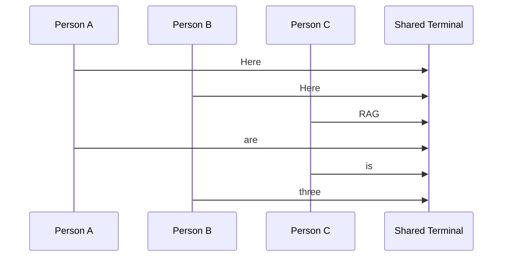

All three are typing simultaneously → writing into one shared terminal → output becomes **interleaved**.

```text
Parallel execution → Concurrent chunks → Shared stream → Interleaved display
```

This is **not** the same as saying the graph executed sequentially.

---

## 🏷️ Node-Aware Streaming

To solve the identification problem, attach **node information** to every streamed chunk.

<table>
<tr><th>❌ Before</th><th>✅ After</th></tr>
<tr><td>

```python
writer(chunk.content)
```
Consumer knows the content — **not its source**.
</td><td>

```python
writer({
    "node": "summary",
    "content": chunk.content
})
```
Consumer now knows `node = summary`, `content = "..."`.
</td></tr>
</table>

Applied to each node:

```python
writer({"node": "advantages", "content": chunk.content})
writer({"node": "disadvantages", "content": chunk.content})
```

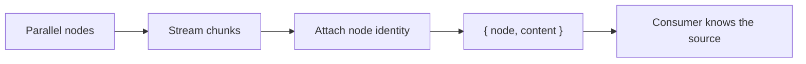

This is especially useful for a UI:

| Chunk source | Routed to |
|---|---|
| `summary` chunk | Summary panel |
| `advantages` chunk | Advantages panel |
| `disadvantages` chunk | Disadvantages panel |

---

## 📦 Separate Buffers

Once every chunk identifies its source, keep a **separate buffer per branch**.

```python
buffers = {
    "summary": "",
    "advantages": "",
    "disadvantages": ""
}

for chunk in app.stream(input_data, stream_mode="custom"):
    node = chunk["node"]
    content = chunk["content"]

    if node in buffers:
        buffers[node] += content
```

**Example — mixed arrival order:**

```text
advantages → "Here"     summary → "RAG"
disadvantages → "Here"  advantages → " are"
summary → " is"
```

**Final buffers (clean, per branch):**

| Branch | Result |
|---|---|
| `summary` | `"RAG is"` |
| `advantages` | `"Here are"` |
| `disadvantages` | `"Here"` |

> [!NOTE]
> Even though the chunks arrived in mixed order, each branch's result stays organized.

---

## 🖥️ Live Streaming + Separate Buffers

Do both at once: **(1)** store chunks in the correct buffer, **(2)** display them immediately.

```python
buffers = {"summary": "", "advantages": "", "disadvantages": ""}

for chunk in app.stream(input_data, stream_mode="custom"):
    node = chunk["node"]
    content = chunk["content"]

    if node in buffers:
        buffers[node] += content
        print(f"[{node.upper()}] {content}", end="", flush=True)
```

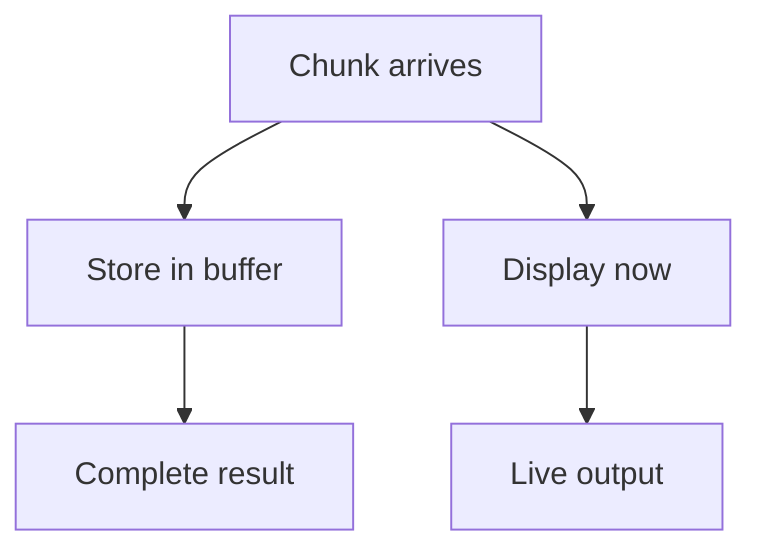

**Example live display** (order still mixed — but source is visible):

```text
[SUMMARY] RAG
[ADVANTAGES] Here
[DISADVANTAGES] Here
[SUMMARY] is
[ADVANTAGES] are
...
```

### ✨ Clean final output (after all branches finish)

```python
print("\nSUMMARY");        print(buffers["summary"])
print("\nADVANTAGES");     print(buffers["advantages"])
print("\nDISADVANTAGES");  print(buffers["disadvantages"])
```

```text
SUMMARY
----------------
RAG is ...

ADVANTAGES
----------------
1. ...
2. ...
3. ...

DISADVANTAGES
----------------
1. ...
2. ...
3. ...
```

---

## 🧪 Practical Code Patterns

<details open>
<summary><b>1️⃣ Basic graph streaming</b></summary>

```python
app = graph.compile()

for chunk in app.stream(input_data):
    print(chunk)
```
</details>

<details open>
<summary><b>2️⃣ LLM token streaming</b></summary>

```python
for chunk in llm.stream("Explain RAG"):
    if chunk.content:
        print(chunk.content, end="", flush=True)
```
</details>

<details open>
<summary><b>3️⃣ Custom streaming</b></summary>

```python
def node(state):
    writer = get_stream_writer()
    writer("Processing...")
    return {}
```

```python
for chunk in app.stream(input_data, stream_mode="custom"):
    print(chunk)
```
</details>

<details open>
<summary><b>4️⃣ Node-aware custom streaming</b></summary>

```python
writer({
    "node": "summary",
    "content": chunk.content
})
```
</details>

<details open>
<summary><b>5️⃣ Separate buffers</b></summary>

```python
buffers = {"summary": "", "advantages": "", "disadvantages": ""}

node = chunk["node"]
content = chunk["content"]

buffers[node] += content
```
</details>

---

## ⚠️ Common Beginner Mistakes

<details>
<summary><b>❌ Mistake 1 — Calling <code>stream()</code> on <code>StateGraph</code></b></summary>

<br>

| ❌ Wrong | ✅ Correct |
|---|---|
| `graph = StateGraph(State)`<br>`graph.stream(...)` | `app = graph.compile()`<br>`app.stream(...)` |

`StateGraph` → **builder**. Compiled `app` → **executable graph**.
</details>

<details>
<summary><b>❌ Mistake 2 — Confusing streaming and parallel execution</b></summary>

<br>

| Streaming | Parallel execution |
|---|---|
| How output is delivered | How independent work is executed |

They are **not synonyms**.
</details>

<details>
<summary><b>❌ Mistake 3 — Assuming parallel output arrives in clean order</b></summary>

<br>

Don't expect `all summary → all advantages → all disadvantages` when all three stream concurrently. **The actual order can be interleaved.**
</details>

<details>
<summary><b>❌ Mistake 4 — Forgetting to accumulate the final answer</b></summary>

<br>

Only doing `writer(chunk.content)` streams the content — but you may also need `answer += chunk.content` to preserve the complete result in state.
</details>

<details>
<summary><b>❌ Mistake 5 — Sending unstructured chunks from many nodes</b></summary>

<br>

`writer(chunk.content)` doesn't identify the source. For multiple parallel streams, use:
```python
writer({"node": "summary", "content": chunk.content})
```
</details>

<details>
<summary><b>❌ Mistake 6 — Thinking mixed output means parallel execution failed</b></summary>

<br>

Mixed output can actually be **evidence that parallel branches are working**. Fix: `Identify source → Route chunk → Separate buffer/UI` — not "make everything sequential."
</details>

<details>
<summary><b>❌ Mistake 7 — Assuming parallelism always gives an exact 1/N speedup</b></summary>

<br>

Actual performance depends on API latency, model processing time, scheduling, rate limits, network conditions, and shared resources. Use parallelism when work is **independent**, not as a guaranteed fixed speedup.
</details>

---

## 🎤 Interview Revision

> [!NOTE]
> Included as a revision section only — the main learning path remains practical.

<details>
<summary><b>Q: What is streaming in LangGraph?</b></summary>
<br>

**A:** Streaming allows the application to receive workflow or model output progressively instead of waiting for the entire workflow to finish.
</details>

<details>
<summary><b>Q: What is the difference between <code>app.stream()</code> and <code>llm.stream()</code>?</b></summary>
<br>

**A:**
| Call | Streams |
|---|---|
| `app.stream()` | Graph/workflow execution data |
| `llm.stream()` | LLM-generated message chunks |
</details>

<details>
<summary><b>Q: Why do we compile a graph?</b></summary>
<br>

**A:** `StateGraph` builds the workflow. `compile()` produces the executable graph application that can be invoked or streamed.
</details>

<details>
<summary><b>Q: What is parallel execution?</b></summary>
<br>

**A:** It allows independent branches of a graph to execute concurrently, rather than waiting for one branch to finish before starting another.
</details>

<details>
<summary><b>Q: What is fan-out?</b></summary>
<br>

**A:** One workflow point branching into multiple execution paths.
```text
START → A, B, C
```
</details>

<details>
<summary><b>Q: What is fan-in?</b></summary>
<br>

**A:** Multiple branches converging into a later node.
```text
A, B, C → Combine
```
</details>

<details>
<summary><b>Q: Why can parallel streaming output appear mixed?</b></summary>
<br>

**A:** Multiple branches produce chunks concurrently, and those chunks arrive through the same stream in an interleaved order.
</details>

<details>
<summary><b>Q: How can we identify which node produced a streamed chunk?</b></summary>
<br>

**A:** Include node metadata in custom streamed data:
```python
writer({"node": "summary", "content": chunk.content})
```
</details>

<details>
<summary><b>Q: Why use separate buffers?</b></summary>
<br>

**A:** They let streamed chunks from different parallel branches be accumulated independently, even when they arrive in mixed order.
</details>

<details>
<summary><b>Q: What are the main stream modes practiced?</b></summary>
<br>

**A:**
| Mode | Memory aid |
|---|---|
| `values` | Whole state |
| `updates` | Changes |
| `messages` | LLM messages |
| `custom` | Application-defined stream data |
| `debug` | Detailed execution information |
</details>

---

## 🧾 One-Page Cheat Sheet

| Concept | Meaning |
|---|---|
| `StateGraph` | Graph builder |
| `compile()` | Creates executable graph |
| `app` | Compiled graph application |
| `app.stream()` | Streams graph execution |
| `llm.stream()` | Streams LLM chunks |
| 🔵 `values` | Full state |
| 🟢 `updates` | State updates |
| 🟡 `messages` | LLM messages/chunks |
| 🟠 `custom` | Custom application stream |
| 🔴 `debug` | Detailed execution information |
| ⚡ Parallel execution | Independent branches execute concurrently |
| 🔀 Fan-out | Split into branches |
| 🔁 Fan-in | Merge/converge branches |
| 🤖 Parallel LLM calls | Multiple independent LLM tasks |
| 🏷️ Node-aware stream | Chunk contains source node |
| 📦 Buffer | Stores chunks for one branch |
| `flush=True` | Helps display streamed output immediately |

### 🧠 One-Line Memory Tricks

| Term | Trick |
|---|---|
| `StateGraph` | Build the workflow |
| `compile()` | Make it executable |
| `app.stream()` | Stream graph execution |
| `llm.stream()` | Stream LLM output |
| `values` | Whole state |
| `updates` | What changed |
| `messages` | LLM messages |
| `custom` | My own stream data |
| `debug` | Detailed execution information |
| Parallel | Independent work concurrently |
| Fan-out | Split |
| Fan-in | Combine |
| Buffer | Collect chunks |
| Node metadata | Know where a chunk came from |

---

## 🏁 Final Mental Model

```mermaid
flowchart TD
    UI[👤 USER INPUT] --> CG[🏗️ COMPILED GRAPH]
    CG --> AS["⚙️ app.stream()"]

    AS --> ST[🌊 STREAMING]
    AS --> PE[⚡ PARALLEL EXECUTION]

    PE --> A[Branch A]
    PE --> B[Branch B]
    PE --> C[Branch C]

    A --> FI[🔁 FAN-IN]
    B --> FI
    C --> FI
    FI --> COMBINE[Combine] --> END1[END]

    ST --> LLMC[LLM chunks]
    LLMC --> CS[🟠 custom stream]
    CS --> NAC[🏷️ Node-aware chunk]

    NAC --> BS[Summary buffer]
    NAC --> BA[Advantages buffer]
    NAC --> BD[Disadvantages buffer]

    BS --> CLEAN[✨ Clean results]
    BA --> CLEAN
    BD --> CLEAN

    style UI fill:#0d47a1,color:#fff
    style CLEAN fill:#2e7d32,color:#fff
    style END1 fill:#2e7d32,color:#fff
```

### The complete relationship

```mermaid
flowchart TD
    LG[🕸️ LANGGRAPH] --> S[🌊 Streaming]
    LG --> PE[⚡ Parallel Execution]

    S --> PO[Progressive output]
    PE --> IB[Independent branches]

    IB --> A[A]
    IB --> B[B]
    IB --> C[C]
    A --> FI[Fan-in]
    B --> FI
    C --> FI
    FI --> COMB[Combine]

    PO --> NAC[Node-aware chunks]
    COMB --> FR[✨ Final result]
    NAC --> SB[Separate buffers]
    SB --> FR

    style LG fill:#1c1c1c,color:#fff
    style FR fill:#2e7d32,color:#fff
```

---

## ✅ Final Completion Checklist

- [ ] I understand the difference between `StateGraph` and the compiled graph.
- [ ] I know why `app.stream()` is used after compilation.
- [ ] I understand what streaming means.
- [ ] I understand `app.stream()`.
- [ ] I understand `llm.stream()`.
- [ ] I understand the difference between graph streaming and LLM token streaming.
- [ ] I understand `values`.
- [ ] I understand `updates`.
- [ ] I understand `messages`.
- [ ] I understand `custom`.
- [ ] I understand `debug`.
- [ ] I can build basic parallel nodes.
- [ ] I understand why independent nodes can execute in parallel.
- [ ] I understand the timing benefit of parallel execution.
- [ ] I understand fan-out.
- [ ] I understand fan-in.
- [ ] I can build parallel LLM calls.
- [ ] I can combine parallel LLM calls with streaming.
- [ ] I understand why parallel streamed output can look mixed.
- [ ] I can attach node information to streamed chunks.
- [ ] I can maintain separate buffers for parallel branches.
- [ ] I can display streamed output while execution is still running.
- [ ] I understand that streaming and parallel execution are different concepts.

---

<div align="center">

### ⭐ You're done with Day 4!

You now understand how LangGraph can **stream workflow/model output progressively**, execute **independent branches concurrently**, split and combine work using **fan-out/fan-in**, and organize concurrent streamed results using **node-aware metadata and separate buffers**.

<br>

| Core idea | Meaning |
|---|---|
| 🌊 **Streaming** | how output arrives |
| ⚡ **Parallel execution** | how independent work runs |
| 🔀 **Fan-out** | split the work |
| 🔁 **Fan-in** | bring the results together |
| 🏷️ **Node-aware streaming** | know which branch produced each chunk |

<br>


</div>
